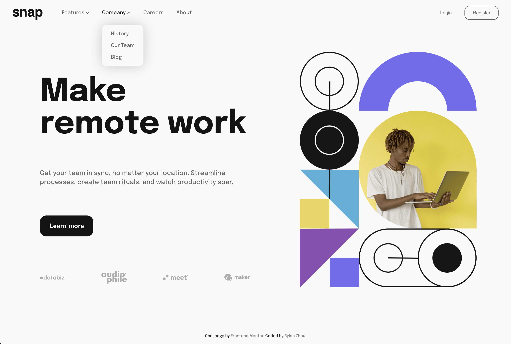

# Frontend Mentor - Expenses Chart Component Solution

This is a solution to the [Expenses chart component challenge on Frontend Mentor](https://www.frontendmentor.io/challenges/expenses-chart-component-e7yJBUdjwt). Frontend Mentor challenges help you improve your coding skills by building realistic projects.

## Table of contents

- [Overview](#overview)
  - [The challenge](#the-challenge)
  - [Screenshot](#screenshot)
  - [Links](#links)
- [My process](#my-process)
  - [Built with](#built-with)
  - [What I implemented](#what-i-implemented)

## Overview

### The challenge

Users should be able to:

- [x] View the bar chart and hover over the individual bars to see the correct amounts for each day
- [x] See the current day’s bar highlighted in a different colour to the other bars
- [x] View the optimal layout for the content depending on their device’s screen size
- [x] See hover states for all interactive elements on the page
- [x] **Bonus**: Use the JSON data file provided to dynamically size the bars on the chart

### Screenshot

|        Desktop        |
| :-------------------: |
|  |

### Links

- Solution URL: [Github](https://github.com/RylanZhou/frontend-mentor-expense-chart-component)
- Live Site URL: [Vercel](https://frontend-mentor-expense-chart-component.vercel.app/)

## My process

### Built with

- Semantic HTML5 markup
- CSS custom properties
- Scss
- Flexbox
- Mobile-first workflow
- [React](https://reactjs.org/) - JS library
- TypeScript

### What I implemented

1. Dynamically load data and set bar height.

2. Animated label showup and bar height change.

3. How to make the bar "grow" from the bottom of a container - add an empty block `
` in flex container and set it with `flex: 1` so that it "pushes" the rest element to the bottom.
